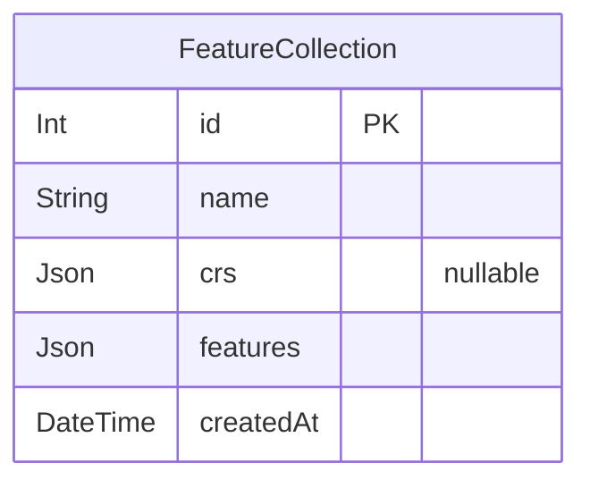

# Test Prisma Markdown Database Display
> Generated by [`prisma-markdown`](https://github.com/samchon/prisma-markdown)

- [default](#default)

## default

### `FeatureCollection`

**Properties**
  - `id`: 
  - `name`: 
  - `crs`: 
  - `features`: 
  - `createdAt`: 