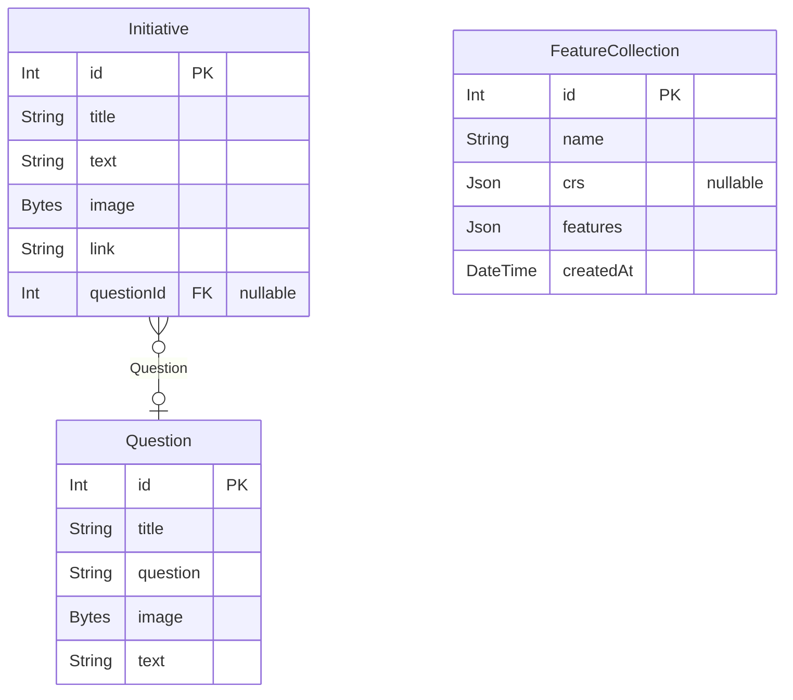

# Auto-Generated Database Diagram
> Generated by [`prisma-markdown`](https://github.com/samchon/prisma-markdown)

- [default](#default)

## default

### `Initiative`

**Properties**
  - `id`: 
  - `title`: 
  - `text`: 
  - `image`: 
  - `link`: 
  - `questionId`: 

### `Question`

**Properties**
  - `id`: 
  - `title`: 
  - `question`: 
  - `image`: 
  - `text`: 

### `FeatureCollection`

**Properties**
  - `id`: 
  - `name`: 
  - `crs`: 
  - `features`: 
  - `createdAt`: 